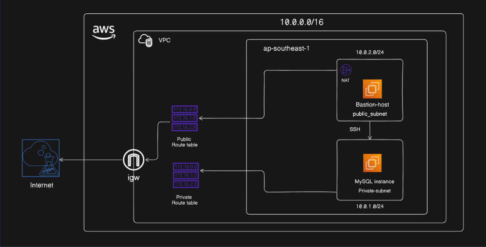

# Deploying MySQL on EC2 Using Systemd

## Overview

This guide deploys MySQL on a private EC2 instance, accessed only through a public bastion host, inside a custom VPC. MySQL is managed via `systemd` so it auto-starts on boot and restarts on failure.

**Architecture**


Here's the fuller picture of how traffic moves through this setup:

**Internet-bound traffic** (public subnet only)
Internet → IGW → Public Route Table (`0.0.0.0/0 → IGW`) → public subnet. This is the only path in or out of the VPC. Both the bastion host and the NAT gateway live in the public subnet and rely on this path — the bastion for inbound SSH, the NAT gateway for relaying outbound traffic from the private subnet.

**Private instance's outbound traffic**
MySQL instance → Private Route Table (`0.0.0.0/0 → NAT gateway`) → NAT gateway → IGW → Internet. The private subnet has no direct IGW route, so this is its *only* way out (e.g. for OS updates). Nothing initiated from the internet can reach in this way — NAT is outbound-only by nature.

**Bastion-to-MySQL traffic (the SSH hop)**
Bastion → MySQL instance uses the **local route** (`10.0.0.0/16 → local`), which every route table in the VPC has automatically. Since both subnets sit inside the same VPC CIDR, traffic between them never leaves the VPC and never touches the IGW or NAT gateway at all. This is why:
- SSH from bastion to the private instance keeps working even if the NAT gateway is deleted or blackholed.
- Access control here comes entirely from **security groups** (MySQL-SG allowing SSH/3306 from Bastion-SG), not from routing.

**The key distinction:** IGW and NAT handle traffic crossing the VPC boundary (to/from the internet). The local route handles traffic staying inside the VPC boundary (subnet-to-subnet). They're independent mechanisms — one can fail without affecting the other.


---

## 1. VPC & Networking

### 1.1 Create VPC
- CIDR: `10.0.0.0/16`
- Region: `ap-southeast-1`

### 1.2 Create Subnets
| Subnet | CIDR | AZ |
|---|---|---|
| Public | 10.0.1.0/24 | ap-southeast-1a |
| Private | 10.0.2.0/24 | ap-southeast-1a |

### 1.3 Internet Gateway
- Create IGW, attach to VPC.

### 1.4 NAT Gateway
- Allocate Elastic IP.
- Create NAT Gateway **in the public subnet**, associate the EIP.

### 1.5 Route Tables
**Public RT**
- `10.0.0.0/16` -> local
- `0.0.0.0/0` -> IGW
- Associate with public subnet.

**Private RT**
- `10.0.0.0/16` -> local
- `0.0.0.0/0` -> NAT Gateway
- Associate with private subnet.

---

## 2. Security Groups

**Bastion-SG** (public subnet)
- Inbound: SSH (22) from your IP
- Outbound: all

**MySQL-SG** (private subnet)
- Inbound: SSH (22) from Bastion-SG
- Inbound: MySQL (3306) from Bastion-SG (or app-tier SG)
- Outbound: all

---

## 3. Launch Instances

### 3.1 Bastion Host
- Subnet: public
- Auto-assign public IP: enabled
- SG: Bastion-SG
- Key pair: `bastion-key.pem`

### 3.2 MySQL Instance
- Subnet: private
- Auto-assign public IP: disabled
- SG: MySQL-SG
- Key pair: same or different — access via agent forwarding, no `.pem` copied to bastion

---

## 4. SSH Access (Agent Forwarding)

On local machine:
```bash
chmod 400 bastion-key.pem
eval "$(ssh-agent -s)"
ssh-add bastion-key.pem
ssh -A ec2-user@<bastion-public-ip>
```

From inside bastion, jump to private instance (key never stored on bastion):
```bash
ssh ec2-user@10.0.2.x
```

---

## 5. Install MySQL

On the private MySQL instance:

```bash
# Ubuntu
sudo apt update -y
sudo apt install -y mysql-server

# Amazon Linux 2/2023
sudo yum update -y
sudo yum install -y mysql-server                              
```
---

## 6. Configure Systemd Service

Amazon Linux/Ubuntu MySQL packages ship a unit file already (`mysqld.service` or `mysql.service`). Verify and manage it directly:

```bash
sudo systemctl daemon-reload
sudo systemctl enable mysqld      # start on boot
sudo systemctl start mysqld
sudo systemctl status mysqld
```

If building a custom unit file (e.g. non-package install):
```bash
sudo nano /etc/systemd/system/mysql.service
```

```ini
# /etc/systemd/system/mysqld.service
[Unit]
Description=MySQL Server
After=syslog.target
After=network.target

[Service]
Type=simple
PermissionsStartOnly=true
ExecStartPre=/bin/mkdir -p /var/run/mysqld
ExecStartPre=/bin/chown mysql:mysql -R /var/run/mysqld
ExecStart=/usr/sbin/mysqld --basedir=/usr --datadir=/var/lib/mysql --plugin-dir=/usr/lib/mysql/plugin --log-error=/var/log/mysql/error.log --pid-file=/var/run/mysqld/mysqld.pid --socket=/var/run/mysqld/mysqld.sock --port=3306
TimeoutSec=300
PrivateTmp=true
User=mysql
Group=mysql
WorkingDirectory=/usr

[Install]
WantedBy=multi-user.target

```

```bash
sudo systemctl daemon-reload
sudo systemctl enable --now mysqld
```

---

## 7. Secure & Verify MySQL

```bash
sudo mysql_secure_installation
mysql -u root -p -e "STATUS;"
```
Follow the prompts to secure your MySQL installation (e.g., set root password, remove anonymous users, disallow root login remotely, remove test database, and reload privilege tables).

Confirm auto-start:
```bash
sudo reboot

# after reboot, from bastion:
ssh ec2-user@10.0.2.x "systemctl is-active mysqld"
```

---

## 8. Validation Checklist

- [ ] Bastion reachable via SSH from local machine (public RT + IGW)
- [ ] Private instance reachable from bastion only (local route, MySQL-SG allows Bastion-SG)
- [ ] Private instance has outbound internet via NAT (test: `curl -I https://amazon.com`)
- [ ] `systemctl status mysqld` shows `active (running)` and `enabled`
- [ ] MySQL survives reboot without manual restart

---

## 9. Concept Clarification
 
### 9.1 Why is NAT Gateway inside a subnet, but IGW isn't?
 
These two objects sit at fundamentally different layers of the network:
 
**IGW is a VPC-level attachment, not a networked device.**
- It's attached once, directly to the VPC (`aws ec2 attach-internet-gateway`) — it doesn't live in any subnet and has no private IP, no ENI, no compute footprint.
- It performs **1:1 NAT**: it maps each instance's Elastic/public IP directly to its private IP at the edge of the VPC. There's no shared resource to route traffic *through* — it's a translation rule referenced by route tables, not a hop.
- Because it isn't "in" a subnet, it doesn't consume subnet IP space and isn't AZ-scoped — it's automatically available across all AZs in the VPC.
**NAT Gateway is a managed, subnet-resident resource.**
- It's provisioned like a mini-instance: it gets an **ENI with a private IP from the subnet's CIDR**, and needs an Elastic IP attached to reach the internet itself.
- It performs **many-to-one NAT (PAT)**: many private instances share the NAT Gateway's single public IP. To do that translation, traffic has to physically arrive *at* the NAT Gateway's ENI — which means it must live in a real subnet with a real route to the internet (the public subnet's `0.0.0.0/0 → IGW` route).
- It's **AZ-scoped** — a NAT Gateway in `ap-southeast-1a` only serves traffic routed to it from route tables in that AZ (or wherever your private subnets route to it). For multi-AZ resilience, you need one NAT Gateway per AZ.

**In short:** IGW is a stateless translation rule at the VPC boundary; NAT Gateway is a stateful, addressable device that must sit inside a subnet to receive and forward traffic like any other host.
 
### 9.2 IGW vs NAT Gateway — core differences
 
| | Internet Gateway (IGW) | NAT Gateway |
|---|---|---|
| **Direction** | Bidirectional — inbound and outbound | Outbound-only (private instances can't be reached from the internet through it) |
| **NAT type** | 1:1 (each instance gets its own public/Elastic IP) | Many:1 (many private IPs share one NAT public IP) |
| **Where it lives** | Attached to the VPC, not a subnet | Deployed inside a specific public subnet, consumes an IP from it |
| **Requires** | Nothing extra | An Elastic IP, and the public subnet it sits in must itself have a route to an IGW |
| **AZ scope** | VPC-wide, spans all AZs automatically | Single-AZ; needs one per AZ for HA |
| **Cost** | Free | Hourly charge + per-GB data processing charge |
| **Who uses it** | Instances with a public IP (needs both an IGW route *and* a public IP/EIP on the instance) | Instances with no public IP that need outbound-only access |
 
### 9.3 Other common points of confusion
 
**"My instance has a public IP but still can't reach the internet."**
A public IP alone isn't enough — the subnet's route table also needs `0.0.0.0/0 → IGW`, and the instance's security group/NACL must allow the traffic. All three (public IP + IGW route + SG/NACL) are required together.
 
**"Why does the private subnet still need a route table if it has no direct internet route?"**
Every subnet must be associated with a route table — if you don't explicitly associate one, AWS uses the VPC's default (main) route table. The private route table always contains the `local` route (mandatory, added automatically) plus whatever you add for internet-bound traffic (the NAT route here).
 
**NAT Gateway vs NAT Instance**
NAT Gateway (used in this lab) is AWS-managed, scales automatically, no patching. A NAT Instance is a regular EC2 instance running NAT software — cheaper at low volume but you manage patching, scaling, and it's a single point of failure unless you build HA yourself. Prefer NAT Gateway unless you have a specific cost/customization reason not to.
 
**Security Groups vs Network ACLs**
Security groups are stateful (return traffic auto-allowed) and attached to ENIs/instances — this is what governs bastion → MySQL access in this lab. NACLs are stateless, attached to subnets, and evaluate rules in numeric order. If everything looks correctly configured in security groups but traffic still fails, check for a restrictive NACL on either subnet.
 
**"Local route" isn't optional or editable in the way other routes are**
The `10.0.0.0/16 → local` route exists in every route table in the VPC by default and can't be deleted. It's what allows any two resources inside the VPC to reach each other directly, regardless of public/private subnet placement — this is the mechanism behind bastion → MySQL connectivity.
 
---
 
## 10. Troubleshooting Guide
 
| Symptom | Likely Cause | Fix |
|---|---|---|
| Can't SSH into bastion at all | Missing `0.0.0.0/0 → IGW` in public RT, SG doesn't allow port 22 from your IP, or instance has no public IP | Verify public RT, SG inbound rule, and that "Auto-assign public IP" was enabled at launch |
| SSH to bastion works, but SSH to private instance from bastion times out | MySQL-SG doesn't allow port 22 from Bastion-SG (or from bastion's private IP); wrong private IP used | Check MySQL-SG inbound rule references Bastion-SG, not a CIDR; confirm private instance's actual private IP |
| `Permission denied (publickey)` when jumping to private instance | Private key not loaded in agent, or `-A` flag omitted when SSHing into bastion | Run `ssh-add key.pem` locally, then `ssh -A ec2-user@bastion-ip`; never copy `.pem` onto the bastion itself |
| `Permissions 0644 for 'key.pem' are too open` | Wrong file permissions on the key | `chmod 400 key.pem` |
| Auth works to bastion but fails oddly on private instance (looks like wrong password/key) | Using the wrong key pair for that specific instance | Confirm which key pair was assigned to the private instance at launch — keys aren't interchangeable across instances |
| Private instance has no internet access (can't `yum update`) | NAT Gateway missing, deleted, or in the wrong subnet; private RT missing `0.0.0.0/0 → NAT`; NAT Gateway's EIP was released | Confirm NAT Gateway status is "Available", check private RT has the NAT route, verify NAT sits in the *public* subnet |
| Route shows `Blackhole` status | Target resource (NAT Gateway, IGW, peering connection) was deleted but the route wasn't cleaned up | Delete the stale route and recreate pointing to a valid target; refresh console — this can be a stale-state display issue too |
| "No route with destination X in route table Y" error when deleting | Console showing stale state; route already removed server-side | Refresh the page, re-open the route table, retry against current state |
| MySQL installed but `systemctl start mysqld` fails | Port 3306 already in use, data directory permissions wrong, or corrupt install | `sudo systemctl status mysqld` and `journalctl -xeu mysqld` for the actual error; check `/var/log/mysqld.log` |
| MySQL doesn't restart after reboot | Service not enabled (only started manually) | `sudo systemctl enable mysqld` (not just `start`) |
| Can connect via `mysql -u root` locally but not from bastion | Bind address restricts to localhost, or MySQL-SG blocks 3306 from Bastion-SG | Check `bind-address` in `my.cnf`, confirm SG inbound rule for port 3306 |
| VPC diagram doesn't match actual routes | CIDR typo, or a route added/removed outside the diagram's assumptions | Re-check actual route tables in console against the diagram — treat the console as source of truth |
 
---

## 11. Quick Reference
 
**Network layout**
| Item | Value |
|---|---|
| VPC CIDR | 10.0.0.0/16 |
| Public subnet | 10.0.1.0/24 (ap-southeast-1a) |
| Private subnet | 10.0.2.0/24 (ap-southeast-1a) |
| Public RT | `10.0.0.0/16 → local`, `0.0.0.0/0 → IGW` |
| Private RT | `10.0.0.0/16 → local`, `0.0.0.0/0 → NAT Gateway` |
 
**Security groups**
| SG | Direction | Type | Protocol | Port | Source/Destination | Purpose |
|---|---|---|---|---|---|---|
| Bastion-SG | Inbound | SSH | TCP | 22 | Your IP (`x.x.x.x/32`) | Admin SSH access from your machine |
| Bastion-SG | Outbound | All traffic | All | All | `0.0.0.0/0` | Allows SSH onward to MySQL-SG + general outbound (default allow-all) |
| MySQL-SG | Inbound | SSH | TCP | 22 | Bastion-SG (by SG ID, not CIDR) | Allows bastion to jump into the instance |
| MySQL-SG | Inbound | MySQL/Aurora | TCP | 3306 | Bastion-SG (or App-tier-SG if you add one later) | DB access, scoped to trusted sources only |
| MySQL-SG | Outbound | All traffic | All | All | `0.0.0.0/0` | Needed for OS updates via NAT; can be tightened to just HTTPS (443) to package mirrors if you want least-privilege |
 
**SSH (agent forwarding)**
```bash
chmod 400 bastion-key.pem
eval "$(ssh-agent -s)"
ssh-add bastion-key.pem
ssh -A ec2-user@<bastion-public-ip>
ssh ec2-user@10.0.2.x                      # from inside bastion, no key needed
```
 
**MySQL install + systemd**
```bash
sudo yum install -y mysql-server
sudo systemctl enable --now mysqld
sudo systemctl status mysqld
sudo mysql_secure_installation
```
 
**Fast diagnostics**
```bash
systemctl is-active mysqld              # is it running
journalctl -xeu mysqld                  # why it failed
curl -I https://amazon.com              # private instance internet check (via NAT)
ip a                                    # confirm instance's actual private IP
```
 
**Golden rules**
- Internet in/out → IGW. Private subnet's internet out → NAT. Subnet-to-subnet → local route. Three separate mechanisms.
- No IGW route = no internet, regardless of public IP.
- `systemctl enable` = survives reboot. `systemctl start` alone does not.
- Blackhole route / stale console error → refresh, re-check target still exists.

## Key Takeaways

- NAT Gateway = outbound internet for private subnet only; it does not enable bastion-to-instance SSH.
- Bastion-to-private SSH works via the VPC local route + security group rules.
- Agent forwarding (`-A`) avoids storing private keys on the bastion — a security practice, not a connectivity requirement.
- `systemctl enable` ensures boot-time start; `Restart=on-failure` in the unit file handles crash recovery.
