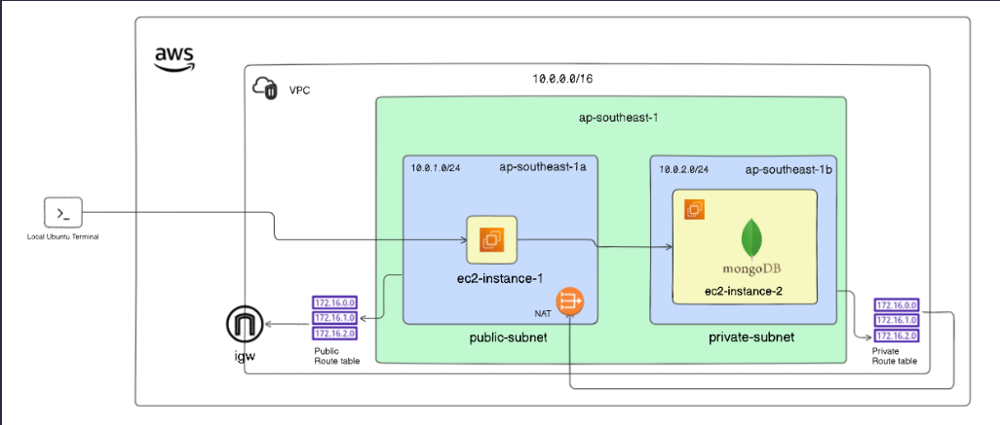

# Deploying MongoDB on EC2 Using Systemd

## Overview

This guide deploys MongoDB on a private EC2 instance, accessed only through a public bastion host, inside a custom VPC. MongoDB is managed via `systemd` (`mongod.service`) so it auto-starts on boot and restarts on failure.

**Architecture**



Here's how traffic moves through this setup:

**Internet-bound traffic** (public subnet only)
Internet → IGW → Public Route Table (`0.0.0.0/0 → IGW`) → public subnet. This is the only path in or out of the VPC. Both the bastion host and the NAT gateway live in the public subnet and rely on this path — the bastion for inbound SSH, the NAT gateway for relaying outbound traffic from the private subnet.

**Private instance's outbound traffic**
MongoDB instance → Private Route Table (`0.0.0.0/0 → NAT gateway`) → NAT gateway → IGW → Internet. The private subnet has no direct IGW route, so this is its *only* way out (e.g. for OS/package updates). Nothing initiated from the internet can reach in this way — NAT is outbound-only by nature.

**Bastion-to-MongoDB traffic (the SSH hop)**
Bastion → MongoDB instance uses the **local route** (`10.0.0.0/16 → local`), which every route table in the VPC has automatically. Since both subnets sit inside the same VPC CIDR, traffic between them never leaves the VPC and never touches the IGW or NAT gateway at all. This is why:
- SSH from bastion to the private instance keeps working even if the NAT gateway is deleted or blackholed.
- Access control here comes entirely from **security groups** (MongoDB-SG allowing SSH/27017 from Bastion-SG), not from routing.

**The key distinction:** IGW and NAT handle traffic crossing the VPC boundary (to/from the internet). The local route handles traffic staying inside the VPC boundary (subnet-to-subnet). They're independent mechanisms — one can fail without affecting the other.

---

## 1. VPC & Networking

### 1.1 Create VPC
- CIDR: `10.0.0.0/16`
- Region: `ap-southeast-1`

### 1.2 Create Subnets
| Subnet | CIDR | AZ |
|---|---|---|
| Public | 10.0.1.0/24 | ap-southeast-1a |
| Private | 10.0.2.0/24 | ap-southeast-1a |

### 1.3 Internet Gateway
- Create IGW, attach to VPC.

### 1.4 NAT Gateway
- Allocate Elastic IP.
- Create NAT Gateway **in the public subnet**, associate the EIP.

### 1.5 Route Tables
**Public RT**
- `10.0.0.0/16` -> local
- `0.0.0.0/0` -> IGW
- Associate with public subnet.

**Private RT**
- `10.0.0.0/16` -> local
- `0.0.0.0/0` -> NAT Gateway
- Associate with private subnet.

---

## 2. Security Groups

**Bastion-SG** (public subnet)
- Inbound: SSH (22) from your IP
- Outbound: all

**MongoDB-SG** (private subnet)
- Inbound: SSH (22) from Bastion-SG
- Inbound: MongoDB (27017) from Bastion-SG (or app-tier SG)
- Outbound: all

---

## 3. Launch Instances

### 3.1 Bastion Host
- Subnet: public
- Auto-assign public IP: enabled
- SG: Bastion-SG
- Key pair: `bastion-key.pem`

### 3.2 MongoDB Instance
- Subnet: private
- Auto-assign public IP: disabled
- SG: MongoDB-SG
- Key pair: same or different — access via agent forwarding, no `.pem` copied to bastion

---

## 4. SSH Access (Agent Forwarding)

On local machine:
```bash
chmod 400 bastion-key.pem
eval "$(ssh-agent -s)"
ssh-add bastion-key.pem
ssh -A ec2-user@<bastion-public-ip>
```

From inside bastion, jump to private instance (key never stored on bastion):
```bash
ssh ec2-user@10.0.2.x
```

---

## 5. Install MongoDB

MongoDB isn't in the default OS repos — you need to add MongoDB's own package repository first.

**Ubuntu:**
```bash
sudo apt update -y
sudo apt install -y gnupg curl

curl -fsSL https://pgp.mongodb.com/server-7.0.asc | \
  sudo gpg -o /usr/share/keyrings/mongodb-server-7.0.gpg --dearmor

echo "deb [signed-by=/usr/share/keyrings/mongodb-server-7.0.gpg] https://repo.mongodb.org/apt/ubuntu jammy/mongodb-org/7.0 multiverse" | \
  sudo tee /etc/apt/sources.list.d/mongodb-org-7.0.list

sudo apt update -y
sudo apt install -y mongodb-org
```

**Amazon Linux 2023:**
```bash
sudo tee /etc/yum.repos.d/mongodb-org-7.0.repo <<'EOF'
[mongodb-org-7.0]
name=MongoDB Repository
baseurl=https://repo.mongodb.org/yum/redhat/9/mongodb-org/7.0/x86_64/
gpgcheck=1
enabled=1
gpgkey=https://pgp.mongodb.com/server-7.0.asc
EOF

sudo yum install -y mongodb-org
```

---

## 6. Configure Systemd Service

The `mongodb-org` package ships a ready `mongod.service` unit. Verify and manage it directly:

```bash
sudo systemctl daemon-reload
sudo systemctl enable mongod      # start on boot
sudo systemctl start mongod
sudo systemctl status mongod
```

If building a custom unit file (e.g. non-package/manual binary install):
```bash
sudo nano /etc/systemd/system/mongod.service
```

```ini
# /etc/systemd/system/mongod.service
[Unit]
Description=MongoDB Database Server
Documentation=https://docs.mongodb.org/manual
After=network.target

[Service]
User=mongodb
Group=mongodb
ExecStart=/usr/bin/mongod --config /etc/mongod.conf
PIDFile=/var/run/mongodb/mongod.pid
Type=simple
Restart=on-failure
TimeoutSec=300
PrivateTmp=true

[Install]
WantedBy=multi-user.target
```

```bash
sudo systemctl daemon-reload
sudo systemctl enable --now mongod
```

**Important config change** — by default `/etc/mongod.conf` binds only to localhost:

```yaml
# /etc/mongod.conf
net:
  port: 27017
  bindIp: 127.0.0.1,10.0.2.x     # add the instance's private IP so the bastion can reach it
```

Restart after editing:
```bash
sudo systemctl restart mongod
```

---

## 7. Secure & Verify MongoDB

Create an admin user (do this *before* enabling auth, while still on localhost):
```bash
mongosh
```
```javascript
use admin
db.createUser({
  user: "admin",
  pwd: passwordPrompt(),
  roles: [{ role: "userAdminAnyDatabase", db: "admin" }, "readWriteAnyDatabase"]
})
exit
```

Enable authentication:
```yaml
# /etc/mongod.conf
security:
  authorization: enabled
```

```bash
sudo systemctl restart mongod
mongosh -u admin -p --authenticationDatabase admin
```

Confirm auto-start:
```bash
sudo reboot

# after reboot, from bastion:
ssh ec2-user@10.0.2.x "systemctl is-active mongod"
```

---

## 8. Validation Checklist

- [ ] Bastion reachable via SSH from local machine (public RT + IGW)
- [ ] Private instance reachable from bastion only (local route, MongoDB-SG allows Bastion-SG)
- [ ] Private instance has outbound internet via NAT (test: `curl -I https://amazon.com`)
- [ ] `systemctl status mongod` shows `active (running)` and `enabled`
- [ ] `bindIp` in `mongod.conf` includes the instance's private IP, not just `127.0.0.1`
- [ ] Authentication enabled and admin user can connect with credentials
- [ ] MongoDB survives reboot without manual restart

---


## 11. Quick Reference

**Network layout**
| Item | Value |
|---|---|
| VPC CIDR | 10.0.0.0/16 |
| Public subnet | 10.0.1.0/24 (ap-southeast-1a) |
| Private subnet | 10.0.2.0/24 (ap-southeast-1a) |
| Public RT | `10.0.0.0/16 → local`, `0.0.0.0/0 → IGW` |
| Private RT | `10.0.0.0/16 → local`, `0.0.0.0/0 → NAT Gateway` |

**EC2 instance config**
| Item | Bastion Host | MongoDB Instance |
|---|---|---|
| Subnet | Public (10.0.1.0/24) | Private (10.0.2.0/24) |
| Auto-assign public IP | Enabled | Disabled |
| Security group | Bastion-SG | MongoDB-SG |
| Key pair | `bastion-key.pem` | Same or separate key (never copied to bastion) |
| AMI | Amazon Linux 2023 / Ubuntu 22.04 | Amazon Linux 2023 / Ubuntu 22.04 |
| Instance type | t3.micro (sufficient for a bastion) | t3.small or larger (MongoDB needs more headroom) |
| Storage | 8 GB gp3 (default) | 20+ GB gp3 (data directory growth) |
| IAM role | None required | None required (unless using SSM/CloudWatch) |

**Security groups**
| SG | Direction | Type | Protocol | Port | Source/Destination | Purpose |
|---|---|---|---|---|---|---|
| Bastion-SG | Inbound | SSH | TCP | 22 | Your IP (`x.x.x.x/32`) | Admin SSH access from your machine |
| Bastion-SG | Outbound | All traffic | All | All | `0.0.0.0/0` | Allows SSH onward to MongoDB-SG + general outbound (default allow-all) |
| MongoDB-SG | Inbound | SSH | TCP | 22 | Bastion-SG (by SG ID, not CIDR) | Allows bastion to jump into the instance |
| MongoDB-SG | Inbound | Custom TCP | TCP | 27017 | Bastion-SG (or App-tier-SG if you add one later) | DB access, scoped to trusted sources only |
| MongoDB-SG | Outbound | All traffic | All | All | `0.0.0.0/0` | Needed for repo/package updates via NAT; can be tightened to just HTTPS (443) if you want least-privilege |

**SSH (agent forwarding)**
```bash
chmod 400 bastion-key.pem
eval "$(ssh-agent -s)"
ssh-add bastion-key.pem
ssh -A ec2-user@<bastion-public-ip>
ssh ec2-user@10.0.2.x                      # from inside bastion, no key needed
```

**MongoDB install + systemd**
```bash
sudo apt install -y mongodb-org             # after adding the repo
sudo systemctl enable --now mongod
sudo systemctl status mongod
mongosh
```

**Fast diagnostics**
```bash
systemctl is-active mongod               # is it running
journalctl -xeu mongod                   # why it failed
curl -I https://amazon.com               # private instance internet check (via NAT)
ip a                                     # confirm instance's actual private IP
mongosh --eval "db.adminCommand('ping')" # confirm mongod is responsive
```

**Golden rules**
- Internet in/out → IGW. Private subnet's internet out → NAT. Subnet-to-subnet → local route. Three separate mechanisms.
- No IGW route = no internet, regardless of public IP.
- `systemctl enable` = survives reboot. `systemctl start` alone does not.
- Correct routing + SG isn't enough for MongoDB — `bindIp` in `mongod.conf` must also include the private IP.
- Create the admin user *before* enabling `authorization` in `mongod.conf`, or you'll lock yourself out.

---

## Key Takeaways

- NAT Gateway = outbound internet for private subnet only; it does not enable bastion-to-instance SSH.
- Bastion-to-private SSH works via the VPC local route + security group rules.
- Agent forwarding (`-A`) avoids storing private keys on the bastion — a security practice, not a connectivity requirement.
- `systemctl enable` ensures boot-time start; `Restart=on-failure` in the unit file handles crash recovery.
- MongoDB's `bindIp` is an application-layer restriction independent of AWS networking — both must be configured correctly for remote access to work.
