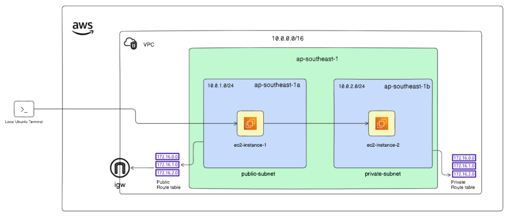

# Complete Step-by-Step Guide: AWS VPC with Public & Private Subnets

---


## STEP 1 — Create a VPC

1. Go to **AWS Console → VPC → Your VPCs → Create VPC**
2. Fill in:
```
Name:       my-vpc
IPv4 CIDR:  10.0.0.0/16
Tenancy:    Default
```
3. Click **Create VPC**

---

## STEP 2 — Create Public & Private Subnets

### Public Subnet
1. Go to **VPC → Subnets → Create Subnet**
2. Fill in:
```
VPC:               my-vpc
Subnet name:       public-subnet
Availability Zone: ap-southeast-1a
IPv4 CIDR:         10.0.1.0/24
```
3. Click **Create Subnet**

### Private Subnet
1. Click **Create Subnet** again
2. Fill in:
```
VPC:               my-vpc
Subnet name:       private-subnet
Availability Zone: ap-southeast-1b
IPv4 CIDR:         10.0.2.0/24
```
3. Click **Create Subnet**

---

## STEP 3 — Create & Attach Internet Gateway

1. Go to **VPC → Internet Gateways → Create Internet Gateway**
2. Fill in:
```
Name: my-igw
```
3. Click **Create**
4. Then click **Actions → Attach to VPC → select my-vpc → Attach**

---

## STEP 4 — Create Route Tables

### Public Route Table
1. Go to **VPC → Route Tables → Create Route Table**
2. Fill in:
```
Name: public-route-table
VPC:  my-vpc
```
3. Click **Create**
4. Select it → **Routes tab → Edit Routes → Add Route:**
```
Destination: 0.0.0.0/0
Target:      my-igw (Internet Gateway)
```
5. Click **Save**
6. Go to **Subnet Associations → Edit → select public-subnet → Save**

### Private Route Table
1. Create another Route Table:
```
Name: private-route-table
VPC:  my-vpc
```
2. No internet route needed
3. Go to **Subnet Associations → Edit → select private-subnet → Save**

---

## STEP 5 — Create Security Groups

### Public Security Group
1. Go to **EC2 → Security Groups → Create Security Group**
2. Fill in:
```
Name:        public-sg
VPC:         my-vpc
```
3. Add **Inbound Rules:**
```
Type: SSH | Protocol: TCP | Port: 22 | Source: 0.0.0.0/0
```
4. Click **Create**

### Private Security Group
1. Create another Security Group:
```
Name:        private-sg
VPC:         my-vpc
```
2. Add **Inbound Rules:**
```
Type: SSH | Protocol: TCP | Port: 22 | Source: 10.0.1.0/24  ← only from public subnet
```
3. Click **Create**

---

## STEP 6 — Launch EC2 Instances

### Public EC2 Instance (ec2-instance-1)
1. Go to **EC2 → Instances → Launch Instance**
2. Fill in:
```
Name:                    ec2-instance-1
AMI:                     Ubuntu 22.04 LTS
Instance type:           t2.micro
Key pair:                create new → name: my-key-pair → download my-key-pair.pem
Network:                 my-vpc
Subnet:                  public-subnet
Auto-assign Public IP:   ENABLE  ← very important
Security Group:          public-sg
```
3. Click **Launch**

### Private EC2 Instance (ec2-instance-2)
1. Launch another instance:
```
Name:                    ec2-instance-2
AMI:                     Ubuntu 22.04 LTS
Instance type:           t2.micro
Key pair:                my-key-pair  ← same key pair!
Network:                 my-vpc
Subnet:                  private-subnet
Auto-assign Public IP:   DISABLE
Security Group:          private-sg
```
3. Click **Launch**

---

## STEP 7 — Enable Public IP on Public Subnet (if not done)

1. Go to **VPC → Subnets → select public-subnet**
2. Click **Actions → Edit Subnet Settings**
3. Check **Enable auto-assign public IPv4 address**
4. Save

---

## STEP 8 — SSH into Public EC2 from Local Machine

On your **local Ubuntu terminal:**
```bash
# Fix permissions
chmod 400 ~/Downloads/my-key-pair.pem

# Connect to public EC2
ssh -i ~/Downloads/my-key-pair.pem ubuntu@<public-ec2-IP>
```

---

## STEP 9 — SSH from Public EC2 to Private EC2

Use **Agent Forwarding** — safest method, no key copy needed:

On your **local terminal:**
```bash
# Step 1 - Start SSH agent
eval "$(ssh-agent -s)"

# Step 2 - Add your key
ssh-add ~/Downloads/my-key-pair.pem

# Step 3 - Connect to public EC2 with agent forwarding
ssh -A -i ~/Downloads/my-key-pair.pem ubuntu@<public-ec2-IP>
```

Now **inside the public EC2**, jump to private:
```bash
ssh ubuntu@<private-ec2-IP>   # uses forwarded agent, no key needed
```

---

## Quick Reference

| What | Value |
|---|---|
| VPC CIDR | 10.0.0.0/16 |
| Public Subnet | 10.0.1.0/24 — ap-southeast-1a |
| Private Subnet | 10.0.2.0/24 — ap-southeast-1b |
| Public EC2 | Has public IP, public-sg, IGW route |
| Private EC2 | No public IP, private-sg, no IGW |
| SSH method | Agent Forwarding (-A flag) |

> **Key Rule:** Both EC2 instances must use the **same key pair** so agent forwarding works seamlessly from public to private.
